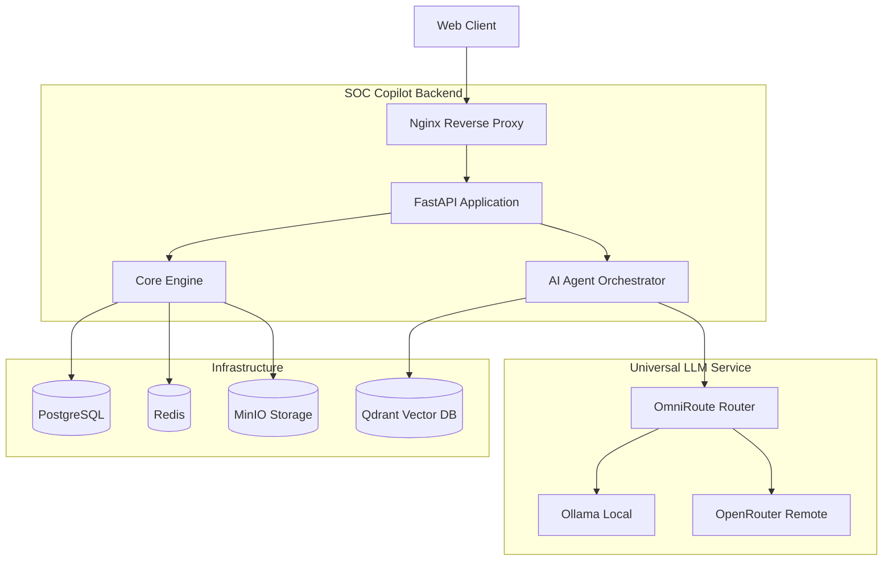

<h1 align="center">SOC Copilot</h1>

<p align="center">
  <em>AI-powered Security Operations Center assistant. Upload logs, get a full incident investigation in minutes — free, self-hosted, open source.</em>
</p>

<p align="center">
  <a href="https://github.com/Aadithya-kl/SOC_Copilet/actions/workflows/ci.yml">
    
  </a>
  <a href="https://github.com/Aadithya-kl/SOC_Copilet/blob/main/LICENSE">
    
  </a>
</p>

---

## 📖 Project Overview

SOC Copilot is a modular monolith backend that orchestrates a team of specialized AI agents to automate the investigation of cybersecurity incidents. It ingests logs, extracts indicators of compromise, correlates events, enriches intelligence, maps to MITRE ATT&CK, and generates explainable, professional reports. It handles the repetitive triage work, freeing analysts for strategic response.

## 🏗️ Architecture



## 🛠️ Technology Stack

- **Backend:** Python 3.12, FastAPI, SQLAlchemy, Pydantic
- **AI/LLM:** LangGraph, OmniRoute, Qdrant (Vector DB)
- **Infrastructure:** PostgreSQL, Redis, MinIO (S3-compatible)
- **DevOps:** Docker, Docker Compose, GitHub Actions, Poetry

## ✨ Features

- 🚀 **Multi-format log file parsing** (EVTX, syslog, etc.)
- 🤖 **Hybrid AI Pipeline** with specialized LangGraph agents
- 🔍 **Automatic IOC Extraction & Threat Intelligence Enrichment**
- 🔗 **Event Correlation & Timeline Reconstruction**
- 📚 **MITRE ATT&CK Mapping & Risk Scoring**
- 💬 **Retrieval-Augmented Generation (RAG)** for conversational incident queries
- 🔒 **Enterprise-Grade Security:** Strict RBAC, secure default configurations, self-hosted capability.

## ⚡ Quick Start (under 5 minutes)

SOC Copilot is designed to be easily deployable on any machine with Docker installed.

1. **Clone the repository:**
   ```bash
   git clone https://github.com/Aadithya-kl/SOC_Copilet.git
   cd SOC_Copilet
   ```

2. **Configure environment:**
   ```bash
   cp .env.example .env
   # Edit .env and add any necessary API keys (like OpenRouter) if you aren't running local models.
   ```

3. **Start the platform:**
   ```bash
   docker compose -f docker-compose.yml -f docker-compose.dev.yml up -d --build
   ```

4. **Access the application:**
   - API Documentation: http://localhost:8000/api/v1/docs

## 🗂️ Repository Structure

```text
backend/
├── app/
│   ├── agents/          # LangGraph AI pipelines and orchestrators
│   ├── core/            # Configuration, logging, exception handling
│   ├── database/        # Database session management
│   ├── llm/             # Universal LLM Service (OmniRoute, OpenRouter, etc.)
│   ├── models/          # SQLAlchemy ORM models
│   ├── modules/         # Feature modules (Auth, Incidents, Uploads, etc.)
│   └── shared/          # Shared DTOs and utilities
├── infrastructure/      # Database migrations (Alembic)
├── tests/               # Unit and integration tests
└── main.py              # FastAPI application factory
docs/                    # Project documentation (Architecture, API, etc.)
```

## 📸 Screenshots

*(Screenshots of the UI, investigation timelines, and generated reports will be added in upcoming phases.)*

## 📚 Documentation

Detailed documentation is available in the `docs/` directory:
- [System Architecture](docs/architecture/system_architecture.md)
- [Backend Architecture](docs/architecture/backend_architecture.md)
- [AI Agent Architecture](docs/architecture/ai_agent_architecture.md)
- [Database ER Diagram](docs/architecture/database_er.md)

## 🗺️ Roadmap

- **Phase 0:** Initialization & Core Infrastructure (Current)
- **Phase 1:** Authentication & Incident Management
- **Phase 2:** Log Ingestion & Parsing
- **Phase 3:** Automated IOC Extraction & Enrichment
- **Phase 4:** Event Correlation & MITRE ATT&CK Mapping
- **Phase 5:** Autonomous Investigation & Reporting
- **Phase 6:** Conversational Assistant (RAG)
- **Phase 7:** UI / Frontend Integration
- **Phase 8:** Polish, Performance, & Launch

## 🤝 Contributing

We welcome contributions from the community! Please see our [Contributing Guide](CONTRIBUTING.md) to learn how to get started, and our [Code of Conduct](CODE_OF_CONDUCT.md) for community guidelines.

## 📄 License

This project is licensed under the Apache 2.0 License - see the [LICENSE](LICENSE) file for details.
