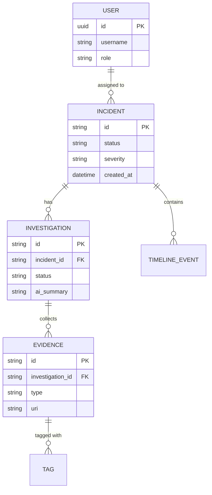
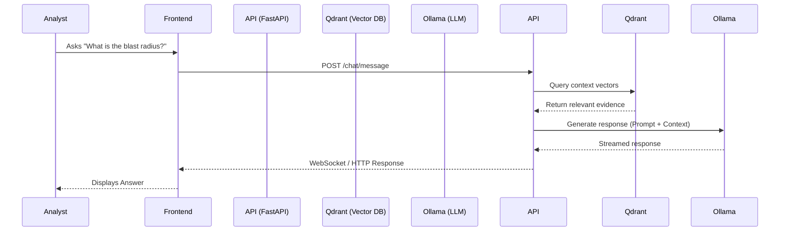

# SOC Copilot Architecture (RC1)

This document details the architectural design of SOC Copilot, outlining system components, data flows, and deployment configurations.

## 1. System Architecture

SOC Copilot operates on a microservices-inspired architecture designed for high throughput, real-time analysis, and deep AI integration.

- **Frontend**: Next.js (React) application serving the interactive UI and WebGL visualizer.
- **Backend API**: FastAPI (Python) handling REST requests, WebSockets, and business logic.
- **Worker Nodes**: Celery workers (Python) processing asynchronous tasks like PCAP analysis and AI model inference.
- **Primary Database**: PostgreSQL storing relational data (incidents, users, RBAC).
- **Vector Store**: Qdrant handling high-dimensional embeddings for semantic search and correlation.
- **Cache / Message Broker**: Redis providing low-latency caching and brokering messages for Celery.
- **Object Storage**: MinIO for storing large evidence files (PCAPs, memory dumps, reports).
- **Local AI Engine**: Ollama serving LLMs securely within the air-gapped or localized environment.

## 2. Folder Structure

```text
SOC_Copilot/
├── assets/           # Master design assets, storyboards, and branding
├── backend/          # FastAPI application, core business logic
│   ├── app/          # API routes, models, schemas, services
│   ├── tests/        # Unit and integration tests
│   └── worker/       # Celery task definitions and processors
├── docker/           # Dockerfiles, entrypoints, and container configs
├── docs/             # Technical documentation, API specs, and architecture
│   ├── architecture/ # Architecture diagrams and documents
│   ├── performance/  # Benchmark and load testing reports
│   └── reports/      # Audits, security reports, runbooks
├── frontend/         # Next.js UI application (to be built)
│   ├── app/          # Next.js app router pages
│   ├── components/   # Reusable UI components
│   └── public/       # Static assets, storyboard frames
├── scripts/          # Utility and maintenance scripts
├── .github/          # CI/CD workflows (GitHub Actions)
├── docker-compose.yml# Production container orchestration
└── README.md         # Project overview and quickstart
```

## 3. Database ER Diagram



## 4. Investigation Pipeline

1. **Trigger**: An external SIEM alert or manual analyst creation generates a new `Incident`.
2. **Triage**: The backend normalizes the incident data.
3. **Investigation Initiation**: The Copilot automatically spawns an `Investigation` object.
4. **Data Gathering**: Celery workers fetch related logs, historical data from PostgreSQL, and similar past incidents from Qdrant.
5. **AI Synthesis**: The aggregated data is fed to the Ollama model for summarization and MITRE mapping.
6. **Delivery**: Results are published to the frontend via WebSockets.

## 5. AI Pipeline

1. **Input Processing**: Text, logs, or user queries are sanitized and chunked.
2. **Embedding Generation**: Chunks are converted into vectors using a local embedding model.
3. **Retrieval (RAG)**: The vector is queried against Qdrant to find semantically relevant historical evidence or Threat Intel.
4. **Prompt Assembly**: The retrieved context is combined with the system prompt and user input.
5. **Inference**: Ollama runs the generative model (e.g., Llama 3) to produce the analysis or response.
6. **Post-Processing**: The output is formatted (Markdown, JSON) and returned to the API layer.

## 6. Threat Intelligence Pipeline

1. **Ingestion**: Scheduled Celery tasks poll external feeds (MISP, OTX) and internal repositories.
2. **Normalization**: Indicators of Compromise (IoCs) are standardized (IP, hash, domain).
3. **Storage**: IoCs are stored in PostgreSQL with confidence scores and embedded in Qdrant for fuzzy matching.
4. **Real-time Lookup**: During an investigation, extracted artifacts are rapidly checked against Redis cache, then PostgreSQL/Qdrant.

## 7. Sequence Diagrams

### Interactive AI Chat


## 8. Deployment Architecture

The system is designed to be deployed in a secure, potentially air-gapped environment.

- **Ingress Controller**: NGINX handles TLS termination and routes traffic to the API or Frontend.
- **App Tier**: Containerized Next.js and FastAPI instances, horizontally scalable.
- **Worker Tier**: Scalable Celery worker fleet processing heavy background tasks.
- **Data Tier**: Persistent volumes for PostgreSQL (structured data), MinIO (blobs), Qdrant (vectors), and Redis (ephemeral/cache).
- **AI Tier**: Dedicated GPU instances running Ollama for low-latency inference.

## 9. Docker Architecture

The project utilizes Docker Compose for seamless orchestration.

- `backend`: The core API server.
- `worker`: Background task processor.
- `postgres`: Relational datastore.
- `redis`: Message broker and cache.
- `minio`: S3-compatible object storage.
- `qdrant`: Vector database.
- `ollama`: Local AI model server.
- `nginx`: Reverse proxy.
- `prometheus` & `grafana`: Monitoring and observability stack.
