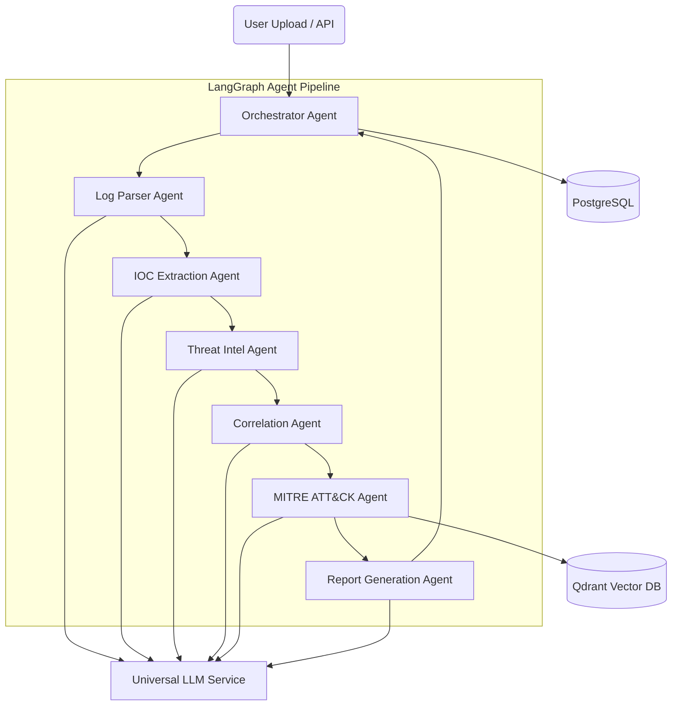

# AI Agent Architecture

```mermaid
graph TD
    User(User Upload / API) --> Orchestrator[Orchestrator Agent]
    
    subgraph "LangGraph Agent Pipeline"
        Orchestrator --> Parser[Log Parser Agent]
        Parser --> Extraction[IOC Extraction Agent]
        Extraction --> Intel[Threat Intel Agent]
        Intel --> Correlation[Correlation Agent]
        Correlation --> MITRE[MITRE ATT&CK Agent]
        MITRE --> Report[Report Generation Agent]
        Report --> Orchestrator
    end
    
    Orchestrator --> DB[(PostgreSQL)]
    Parser --> LLM[Universal LLM Service]
    Extraction --> LLM
    Intel --> LLM
    Correlation --> LLM
    MITRE --> LLM
    Report --> LLM
    
    MITRE --> VDB[(Qdrant Vector DB)]
```
