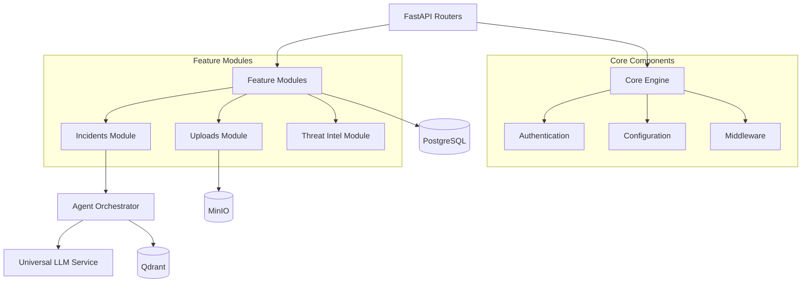

# Backend Architecture

```mermaid
graph TD
    API[FastAPI Routers] --> Core[Core Engine]
    API --> Modules[Feature Modules]
    
    subgraph "Core Components"
        Core --> Auth[Authentication]
        Core --> Config[Configuration]
        Core --> Middleware[Middleware]
    end
    
    subgraph "Feature Modules"
        Modules --> Incidents[Incidents Module]
        Modules --> Uploads[Uploads Module]
        Modules --> Intel[Threat Intel Module]
    end
    
    Incidents --> Agents[Agent Orchestrator]
    Agents --> LLM[Universal LLM Service]
    
    Modules --> DB[(PostgreSQL)]
    Agents --> VDB[(Qdrant)]
    Uploads --> S3[(MinIO)]
```
