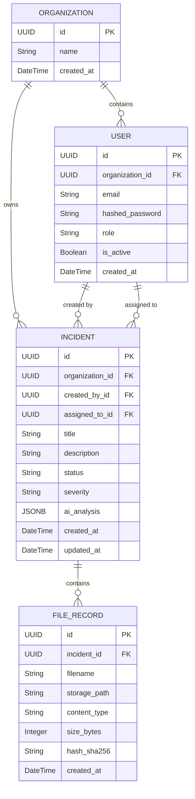

# Database Entity-Relationship Diagram

```mermaid
erDiagram
    ORGANIZATION ||--o{ USER : contains
    ORGANIZATION ||--o{ INCIDENT : owns
    USER ||--o{ INCIDENT : "created by"
    USER ||--o{ INCIDENT : "assigned to"
    INCIDENT ||--o{ FILE_RECORD : contains
    
    ORGANIZATION {
        UUID id PK
        String name
        DateTime created_at
    }
    
    USER {
        UUID id PK
        UUID organization_id FK
        String email
        String hashed_password
        String role
        Boolean is_active
        DateTime created_at
    }
    
    INCIDENT {
        UUID id PK
        UUID organization_id FK
        UUID created_by_id FK
        UUID assigned_to_id FK
        String title
        String description
        String status
        String severity
        JSONB ai_analysis
        DateTime created_at
        DateTime updated_at
    }
    
    FILE_RECORD {
        UUID id PK
        UUID incident_id FK
        String filename
        String storage_path
        String content_type
        Integer size_bytes
        String hash_sha256
        DateTime created_at
    }
```
