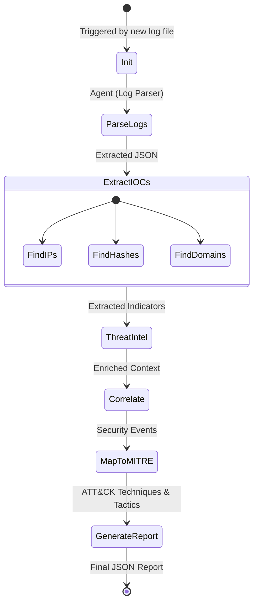

# Investigation Pipeline (LangGraph)

```mermaid
stateDiagram-v2
    [*] --> Init: Triggered by new log file
    
    Init --> ParseLogs: Agent (Log Parser)
    ParseLogs --> ExtractIOCs: Extracted JSON
    
    state ExtractIOCs {
        [*] --> FindIPs
        [*] --> FindHashes
        [*] --> FindDomains
    }
    
    ExtractIOCs --> ThreatIntel: Extracted Indicators
    ThreatIntel --> Correlate: Enriched Context
    
    Correlate --> MapToMITRE: Security Events
    MapToMITRE --> GenerateReport: ATT&CK Techniques & Tactics
    
    GenerateReport --> [*]: Final JSON Report
```
