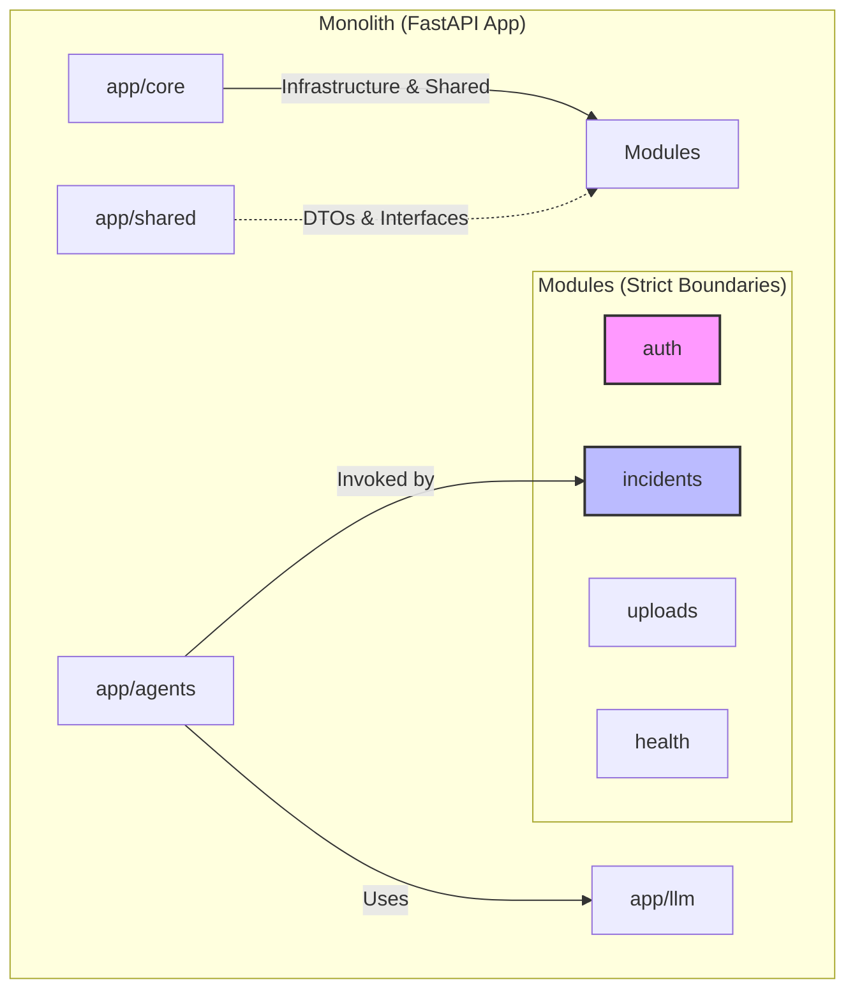

# Modular Monolith Structure

```mermaid
graph TD
    subgraph "Monolith (FastAPI App)"
        Core[app/core] --> |Infrastructure & Shared| Modules
        
        subgraph "Modules (Strict Boundaries)"
            Auth[auth]
            Incidents[incidents]
            Uploads[uploads]
            Health[health]
        end
        
        Shared[app/shared] -.-> |DTOs & Interfaces| Modules
        
        Agents[app/agents] --> |Invoked by| Incidents
        Agents --> |Uses| LLM[app/llm]
    end
    
    style Auth fill:#f9f,stroke:#333,stroke-width:2px
    style Incidents fill:#bbf,stroke:#333,stroke-width:2px
```
