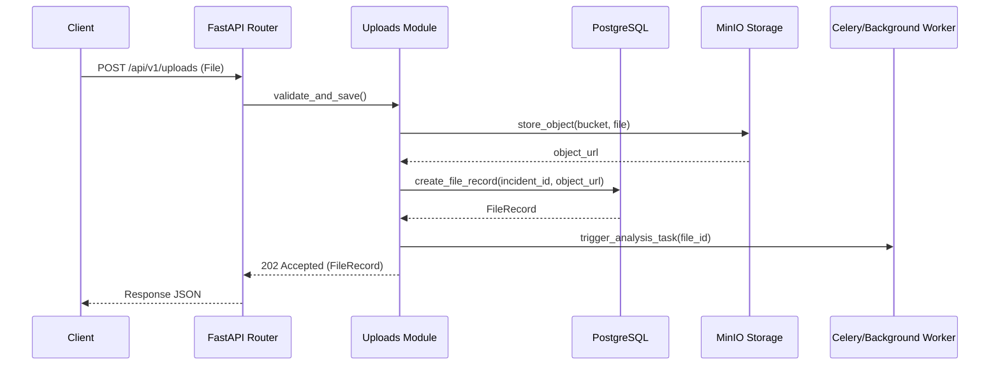

# Request Flow (File Upload)

```mermaid
sequenceDiagram
    participant Client
    participant API as FastAPI Router
    participant Module as Uploads Module
    participant DB as PostgreSQL
    participant MinIO as MinIO Storage
    participant Worker as Celery/Background Worker
    
    Client->>API: POST /api/v1/uploads (File)
    API->>Module: validate_and_save()
    Module->>MinIO: store_object(bucket, file)
    MinIO-->>Module: object_url
    Module->>DB: create_file_record(incident_id, object_url)
    DB-->>Module: FileRecord
    Module->>Worker: trigger_analysis_task(file_id)
    Module-->>API: 202 Accepted (FileRecord)
    API-->>Client: Response JSON
```
