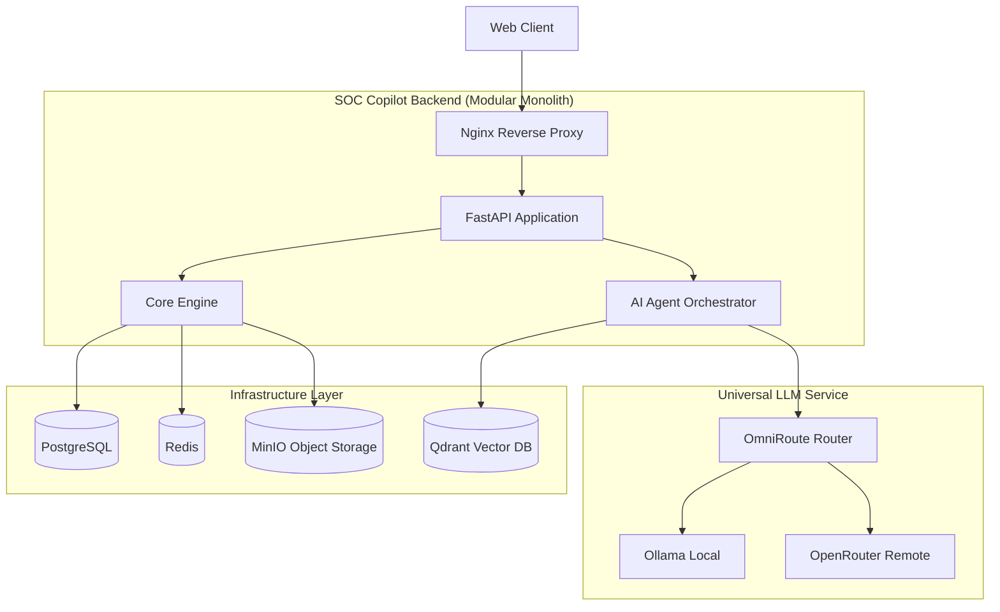

# System Architecture

```mermaid
graph TD
    Client[Web Client] --> Nginx[Nginx Reverse Proxy]
    
    subgraph "SOC Copilot Backend (Modular Monolith)"
        Nginx --> API[FastAPI Application]
        API --> Core[Core Engine]
        API --> Agents[AI Agent Orchestrator]
    end
    
    subgraph "Infrastructure Layer"
        Core --> DB[(PostgreSQL)]
        Core --> Cache[(Redis)]
        Agents --> VDB[(Qdrant Vector DB)]
        Core --> S3[(MinIO Object Storage)]
    end
    
    subgraph "Universal LLM Service"
        Agents --> OmniRoute[OmniRoute Router]
        OmniRoute --> LocalLLM[Ollama Local]
        OmniRoute --> OpenRouter[OpenRouter Remote]
    end
```
